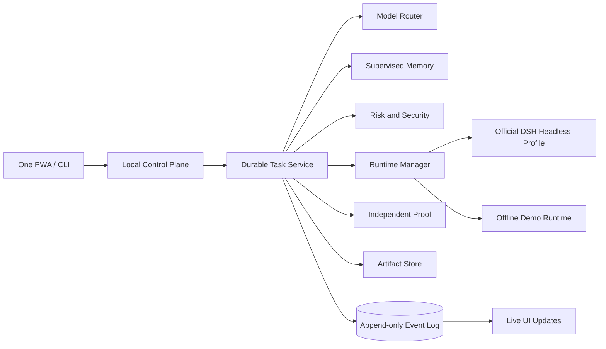

# DeepSeek Harness One

[中文简介](#中文简介) · [English Introduction](#english-introduction)

## 中文简介

**DeepSeek Harness One = 官方 DeepSeek Harness 内核 + 面向真实工作的 Agent OS 产品层。**

它不是重写 DeepSeek Harness，而是在保留原版插件化 Agent 内核、工具、Sandbox、Session 与扩展能力的基础上，把“会话型 AI Agent”升级为一个**可以长期工作、持续记忆、可靠交付结果的本地优先任务系统**。

它的核心优势很简单：

- **任务，而不只是聊天**：任务可排队、暂停、恢复、取消、重试，并能在进程重启后恢复状态。
- **交付，而不只是回答**：结果以可检查的 Artifact 保存，并在完成前经过独立 Proof 验证。
- **记忆，但由你控制**：重要信息先成为候选记忆，只有用户确认后才进入长期记忆。
- **自动选择合适的模型**：通过 `fast / auto / deep` 路由，让强模型负责规划与审查，经济模型负责常规执行。
- **本地优先、安全、可扩展**：默认只在本机运行，提供风险审批、Secret Redaction、安全检查，并兼容 DeepSeek Harness 的插件生态。

用户只需要理解四个概念：**Workspace、Task、Artifact、Memory**。其余 Provider、Profile、模型路由、验证 Agent、Guardrails 与插件安装，都尽量留在产品幕后。

> **一句话：把 DeepSeek Harness 从一个优秀的 Agent Harness，变成一个真正能把事情持续做完并证明已经做完的 Agent 工作系统。**

## English Introduction

**DeepSeek Harness One = the official DeepSeek Harness kernel + a product-grade Agent OS layer for real work.**

It does not rewrite DeepSeek Harness. Instead, it preserves the original plugin-based agent kernel, tools, sandbox, sessions, and extension model, then upgrades the experience from a conversational agent into a **local-first work system that can run durable tasks, build supervised memory, and deliver verifiable results**.

Its core advantages are straightforward:

- **Tasks, not just chats** — queue, pause, resume, cancel, retry, and recover work across process restarts.
- **Deliverables, not just answers** — results are stored as inspectable Artifacts and independently verified before completion.
- **Memory under user control** — useful facts become memory candidates first and are persisted only after explicit approval.
- **Automatic model routing** — `fast / auto / deep` policies use stronger models for planning and review while economical models handle routine execution.
- **Local-first, secure, and extensible** — loopback by default, with approval gates, secret redaction, security checks, and compatibility with the DeepSeek Harness plugin ecosystem.

The user-facing model stays intentionally small: **Workspace, Task, Artifact, Memory**. Providers, profiles, routing, verification agents, guardrails, and extension installation remain behind the product layer whenever possible.

> **In one sentence: DeepSeek Harness One turns a powerful agent harness into a durable work system that keeps working until it can deliver—and prove—the result.**

---

The user-facing model is intentionally small:

- **Workspace** — where the agent is allowed to work.
- **Task** — the durable unit of intent, execution and history.
- **Artifact** — the inspectable result, not merely a chat response.
- **Memory** — approved continuity that compounds across tasks.

Everything else—profiles, provider routes, subprocesses, verification agents, guardrails and extension installation—stays behind this product model.

## What is implemented

The first release is a runnable integrated foundation, not a static mockup:

- A zero-runtime-dependency Node.js control plane and responsive PWA.
- Event-sourced task history with five observable phases.
- Concurrent queueing, pause, resume, cancel, retry and restart interruption recovery.
- Real execution through `dsh --profile headless` when the official CLI is available.
- A built-in offline demonstration runtime when DSH is not installed.
- Automatic `fast / auto / deep` routing policy with strong planning and review tiers.
- Explicit approval gates for high-impact task intent.
- Three-layer memory with candidates that require user approval.
- Artifact collection and safe local preview/download.
- Independent proof checks before a task is marked complete.
- Read-only local security posture checks with secret redaction.
- A curated integration registry for Mnemon, durable workflows, tier routing, proof, guardrails, security audit, marketplace, vision, AgentRQ, Mirage, Open Design, Archify and Brooks Lint.
- A complete HTTP API, Server-Sent Events stream, CLI, Docker configuration and automated tests.

No third-party project source is copied into this repository. Integrations are installed through their published DSH bundles, packages or documented adapters, preserving clear ownership and upgrade boundaries.

## Quick start

Requirements: Node.js 22.16 or newer.

```bash
git clone https://github.com/JackZeng/DeepSeek-Harness-One.git
cd DeepSeek-Harness-One
npm run doctor
npm start
```

Open `http://127.0.0.1:3210`.

There are no production npm dependencies to install. The app runs directly on Node's standard library.

### Try it without DeepSeek Harness

```bash
npm run demo
```

Demo mode exercises planning, routing, execution, artifact generation, verification and memory suggestions entirely on the local machine. It never calls an external model.

### Connect the official DeepSeek Harness

Run the official launcher once and configure a model:

```bash
npx -y @deepseek-ai/dsh web
```

Then make a `dsh` executable available on `PATH`, or configure the command used by One:

```bash
export DSH_ONE_DSH_COMMAND="dsh"
export DSH_ONE_DSH_PROFILE="headless"
npm start
```

When `dsh` is detected, tasks execute as:

```text
dsh --profile headless "<durable task contract>"
```

The process runs with the selected workspace as its current directory. One captures its output, collects any declared artifacts, performs verification, and records the full lifecycle.

## Commands

```text
dsh-one serve [--host 127.0.0.1] [--port 3210] [--demo] [--no-open]
dsh-one demo
dsh-one run "task goal" [--workspace ws_demo] [--mode auto]
dsh-one doctor
dsh-one setup
dsh-one profile [--output install-plan.md]
```

Useful npm aliases:

```bash
npm start
npm run dev
npm run demo
npm run doctor
npm run profile
npm run check
npm test
```

## Recommended DSH capability stack

The control plane works independently of these plugins, while the strongest production configuration combines it with:

| Layer | Integration | Role |
|---|---|---|
| Kernel | `deepseek-ai/deepseek-harness` | Official agent loop, profiles, sessions, tools, approvals and subagents |
| Memory | `omdsh-dev/dsh-mnemon` | Supervised three-layer local memory |
| Workflow | `dsh-external/dsh_workflow` | Named, resumable and auditable multi-agent workflows |
| Routing | `BruceLanLan/dsh-tier-router` | Strong planning/review and economical execution |
| Acceptance | `EvilIrving/dsh-proof` | Read-only independent completion gate |
| Runtime safety | `openguardrails/openguardrails` | Request, response and tool-call policy decisions |
| Local safety | `omdsh-dev/dsh-security-audit` | Credentials metadata, plugin source and exposure checks |
| Ecosystem | `dsh-market/dsh-market` | Curated plugin discovery and lifecycle management |
| Vision | `liustack/modlens` | Structured visual evidence for text-only routes |

Generate the current installation plan:

```bash
npm run profile -- --output install-plan.md
```

See [Integration Guide](docs/INTEGRATIONS.md) for compatibility boundaries and the optional Team, Enterprise Data, Studio and Engineering packs.

## Architecture



The official DSH remains responsible for model-visible context, tool execution, sandbox policy and agent semantics. One owns product-level task durability, workspace selection, execution presentation, local artifacts, approval UX and cross-run continuity.

Read [Architecture](docs/ARCHITECTURE.md) and [ADR-0001](docs/decisions/0001-keep-dsh-as-kernel.md).

## Data and privacy

By default, One binds only to `127.0.0.1` and stores state in `~/.dsh-one`:

```text
~/.dsh-one/
├── events/events.jsonl
├── state/workspaces.json
├── state/memory.json
├── state/settings.json
├── artifacts/<task-id>/
└── demo-workspace/
```

One does not collect telemetry. Task logs pass through token-shaped secret redaction before persistence. Memory refuses text that appears to contain a credential. Local security scans inspect bounded metadata and do not upload content.

Review [Security Model](docs/SECURITY.md) before exposing the service beyond loopback.

## API

The local API is intentionally small and inspectable:

- `GET /api/bootstrap`
- `GET|POST /api/workspaces`
- `GET|POST /api/tasks`
- `GET /api/tasks/:id`
- `POST /api/tasks/:id/actions`
- `GET|POST /api/memory`
- `POST /api/memory/candidates/:id`
- `GET|POST /api/security`
- `GET /api/extensions`
- `POST /api/extensions/:id`
- `GET|PUT /api/settings`
- `GET /api/events` — Server-Sent Events
- `GET /api/artifacts/:task/:file`

See [Architecture](docs/ARCHITECTURE.md) for event and lifecycle contracts.

## Nightly ecosystem evolution

One includes a guarded GitHub Actions workflow that runs every day at **23:30 Asia/Manila**. It searches for new and updated DeepSeek Harness projects, ranks their useful traits, and may prepare at most one small independent improvement while preserving One's workspace/task/artifact/memory product model.

The workflow never installs or executes candidate repositories. README content is treated as untrusted evidence; generated changes are limited by protected paths, change budgets, secret and unsafe-capability scans, an independent product review, Node.js 22/24 tests and a Docker build. Successful changes go through an isolated automation branch and pull request before merge.

Discovery works with the built-in `GITHUB_TOKEN`. To enable model-assisted selection and implementation, add `DSH_ONE_EVOLVER_API_KEY` or `DEEPSEEK_API_KEY` as a repository secret. Without a key, the nightly task still updates the ecosystem report without modifying product code.

See [Ecosystem Autopilot](docs/ECOSYSTEM_AUTOPILOT.md) and the latest [Ecosystem Report](docs/ecosystem/latest.md).

## Validation

```bash
npm run check
npm test
```

The test suite covers routing, risk classification, event durability, redaction, memory approval and deduplication, proof checks, extension plans, high-impact approval, HTTP boot and a complete demonstration task lifecycle.

## Current boundary

Version `0.1.0` establishes the complete product architecture and a working local experience. The following require their upstream projects or a future One release and are not falsely presented as built-in today:

- Native Electron tray/window packaging.
- Interactive reuse of an already-open DSH Web session.
- Managed cloud sync and multi-user RBAC.
- Full OpenGuardrails hosted policy runtime.
- Automatic installation of guided integrations such as agent presets.
- Enterprise connectors from Mirage.
- Open Design's full editable canvas embedded inside One.

These are explicit roadmap items rather than hidden placeholders. See [Roadmap](docs/ROADMAP.md).

## Contributing

Read [AGENTS.md](AGENTS.md), [CONTRIBUTING.md](CONTRIBUTING.md), and [Security](SECURITY.md). The project deliberately prefers stable contracts, reversible effects and a small user-facing vocabulary over feature accumulation.

## License

DeepSeek Harness One is released under the [MIT License](LICENSE). Upstream integrations retain their own licenses and trademarks; see [Third-Party Notices](THIRD_PARTY_NOTICES.md).
